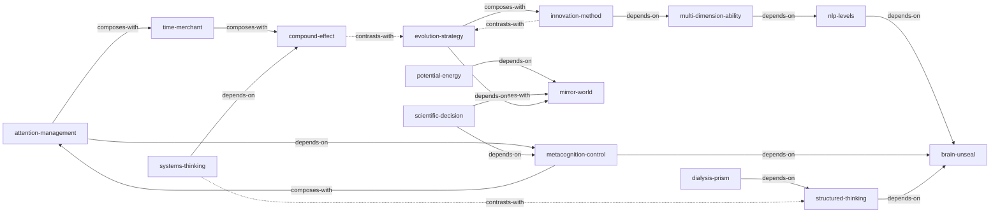

# 《认知红利》— Skill Index

> 本书由 book2skill 蒸馏, 共产出 **15** 个 skills。
> 处理时间: 2026-04-15

## 关于这本书

- **作者**: 谢春霖
- **出版年**: 2019
- **一句话主旨**: 通过重塑核心概念和升级思维模式（从零维到三维思维），建立可执行的认知操作系统
- **整书理解**: 见 [BOOK_OVERVIEW.md](./BOOK_OVERVIEW.md)

---

## Skill 列表 (按主题分组)

### 概念重塑 — 重新理解财富

- [`attention-management`](./attention-management/SKILL.md) — 注意力是最宝贵的财富，管理注意力的三个黑洞与四个高回报方向
- [`time-merchant`](./time-merchant/SKILL.md) — 时间商人四模式，收入差距的本质是模式之争而非价值之争
- [`compound-effect`](./compound-effect/SKILL.md) — 复利效应设计三步法，将复利从金融工具泛化为通用增长模型

### 概念重塑 — 重新理解自己

- [`nlp-levels`](./nlp-levels/SKILL.md) — NLP理解层次六层模型，升维思考降维解决问题
- [`metacognition-control`](./metacognition-control/SKILL.md) — 元认知三阶段控制，掌控大脑的输入/处理/输出
- [`multi-dimension-ability`](./multi-dimension-ability/SKILL.md) — 多维能力打造，通过能力组合创造稀缺性

### 概念重塑 — 重新理解世界

- [`potential-energy`](./potential-energy/SKILL.md) — 四种势能差与点线面体框架，站上趋势的制高点
- [`mirror-world`](./mirror-world/SKILL.md) — 镜像世界与四域空间，不同世界用不同生存策略

### 大脑升级 — 思维力提升

- [`brain-unseal`](./brain-unseal/SKILL.md) — 大脑封印解除，消除负面词语和负面情绪对思维的阻碍
- [`dialysis-prism`](./dialysis-prism/SKILL.md) — 透析三棱镜，穿透现象看本质的三步问题分析法
- [`structured-thinking`](./structured-thinking/SKILL.md) — 结构化思维与MECE，将混乱信息组织成清晰结构
- [`systems-thinking`](./systems-thinking/SKILL.md) — 系统性思维，从要素到关系到动态的系统级思考

### 大脑升级 — 解决所有问题

- [`scientific-decision`](./scientific-decision/SKILL.md) — 科学决策四步法与第三选择，将选择题升级为计算题
- [`evolution-strategy`](./evolution-strategy/SKILL.md) — 演化策略四步循环，在不确定环境中靠MVP和迭代增长
- [`innovation-method`](./innovation-method/SKILL.md) — 创新方法论，重组式创新（寻宝图）与突变式创新（拆解修改）

---

## 引用图



图例:
- `-->`  depends-on (使用前提)
- `-.->` contrasts-with (互补/对比)
- `===>` composes-with (经常配合使用)

---

## 推荐学习顺序

(从依赖图的叶子节点开始，向上)

1. **brain-unseal** — 解除思维封印，是所有后续skill的基础前提
2. **attention-management** — 管理最基础的资源，建立正确的价值排序
3. **metacognition-control** — 掌控大脑的三阶段，在attention-management基础上深入
4. **nlp-levels** — 理解六层认知模型，为升维思考建立框架
5. **time-merchant** — 重新理解收入模式，应用attention-management的产出
6. **compound-effect** — 理解复利增长模型，与time-merchant互补
7. **multi-dimension-ability** — 打造稀缺性能力组合，依赖nlp-levels中的身份定位
8. **mirror-world** — 理解世界的运行规则，为后续策略skill提供基础
9. **potential-energy** — 学会借势能，在mirror-world框架上选择战略位置
10. **structured-thinking** — MECE思维，在brain-unseal之后升级到二维思维
11. **dialysis-prism** — 问题分析法，综合structured-thinking的技能
12. **systems-thinking** — 系统级思考，从二维升级到三维动态思维
13. **scientific-decision** — 科学决策，综合metacognition和mirror-world
14. **evolution-strategy** — 演化策略，应对mirror-world中的不确定性
15. **innovation-method** — 创新方法论，最综合的skill，需要多维知识积累

---

## 接入 darwin-skill

所有 skill 均带有 `test-prompts.json` (darwin-skill 兼容格式), 可直接接入自动进化:

```
darwin evolve books/cognitive-dividend-skill/
```

---

## 审计轨迹

- 候选单元池: [candidates/](./candidates/)
- 被淘汰的候选 (含原因): [rejected/](./rejected/)
- BOOK_OVERVIEW: [BOOK_OVERVIEW.md](./BOOK_OVERVIEW.md)
- 三重验证通过清单: [verified.md](./verified.md)
